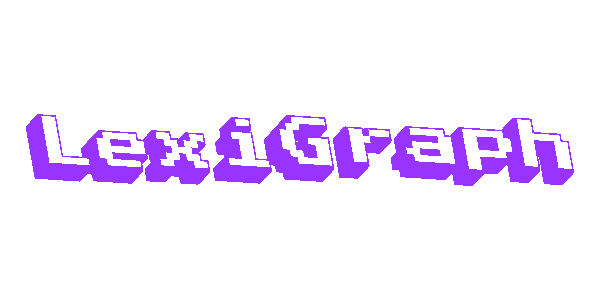
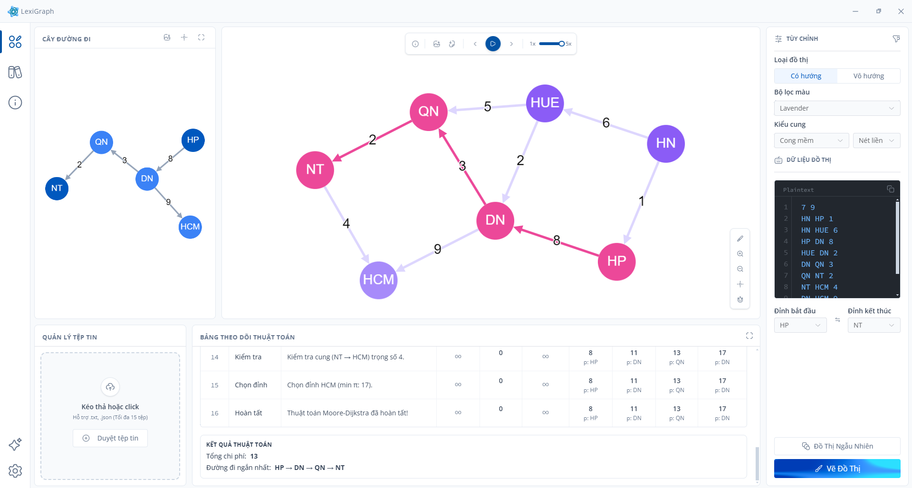

<div align="center">
  

  <br />
  <br />

  
  
  
  
  

  <br />

  
  
  
  
</div>

<br />

# LexiGraph

> A modern, interactive desktop application for visualizing graph theory and algorithms.

<div align="center">
  
</div>

LexiGraph is a comprehensive tool designed to help developers, students, and educators intuitively understand graph algorithms. Built with a robust web stack and packaged as a desktop application, it provides a seamless experience for drawing graphs, customizing visual themes, and observing algorithmic processes step-by-step.

## Table of Contents

- [Features](#features)
- [Color Palette](#color-palette)
- [Tech Stack](#tech-stack)
- [Project Structure](#project-structure)
- [Getting Started](#getting-started)
- [Usage](#usage)
- [License](#license)

---

## Features

- **Interactive Visualization:** Renders complex graphs efficiently with smooth animations.
- **Algorithm Execution:** Supports step-by-step execution of core graph algorithms (e.g., BFS, DFS, Dijkstra) with distinct state highlighting (Processing, Visited, Path).
- **Smart Input Editor:** Features a built-in code editor with syntax highlighting for quick text-to-graph data entry.
- **Dynamic Theming:** Includes multiple professional color themes tailored for long reading sessions and high contrast.
- **Flexible Configurations:** Easily toggle between directed and undirected graphs, adjust layout constraints, and manage edge weights.

---

## Color Palette

The application features dynamically configurable themes for graph visualization. Here are the primary color roles across different themes:

| Theme          | Node Bg               | Node Selected         | Edge                  | Visited               | Processing            | Path                  |
| :------------- | :-------------------- | :-------------------- | :-------------------- | :-------------------- | :-------------------- | :-------------------- |
| **Default**    |  `3b82f6` |  `1e3a8a` |  `94a3b8` |  `64748b` |  `f59e0b` |  `10b981` |
| **Sunset**     |  `f97316` |  `7c2d12` |  `fcd34d` |  `a8a29e` |  `eab308` |  `14b8a6` |
| **Monochrome** |  `475569` |  `0f172a` |  `94a3b8` |  `6b7280` |  `06b6d4` |  `8b5cf6` |
| **Nordic**     |  `0d9488` |  `134e4a` |  `99f6e4` |  `64748b` |  `d97706` |  `e11d48` |
| **Forest**     |  `16a34a` |  `14532d` |  `bbf7d0` |  `78716c` |  `eab308` |  `0284c7` |
| **Cyberpunk**  |  `db2777` |  `831843` |  `fbcfe8` |  `8b5cf6` |  `f59e0b` |  `06b6d4` |
| **Lavender**   |  `8b5cf6` |  `4c1d95` |  `ddd6fe` |  `a78bfa` |  `fbbf24` |  `ec4899` |

---

## Tech Stack

| Domain                  | Technology                 |
| :---------------------- | :------------------------- |
| **Core Framework**      | Vue 3 (Composition API)    |
| **Build Tool**          | Vite                       |
| **Desktop Environment** | Electron                   |
| **Graph Engine**        | Cytoscape.js               |
| **Styling & UI**        | Tailwind CSS, Element Plus |
| **Language**            | TypeScript                 |

---

## Project Structure

<details>
<summary><b>Click to expand the directory tree</b></summary>

```text
LexiGraph/
├── electron/                 # Electron backend core (Main Process & Preload)
│   ├── main.ts               # Window creation and application lifecycle management
│   └── preload.ts            # Secure IPC bridge between Electron and Vue frontend
├── public/                   # Global static assets (Fonts, Icons, SVG)
├── src/                      # Frontend source code (Renderer Process)
│   ├── assets/               # Internal Vue static assets (Icons, Images)
│   ├── components/           # Reusable UI components
│   │   ├── AlgorithmHistory/ # Algorithm execution history panel
│   │   ├── DirectoryView/    # File and folder management
│   │   ├── GraphInput/       # Graph input and configuration panel
│   │   └── GraphView.vue     # Graph rendering component (Cytoscape.js wrapper)
│   ├── composables/          # Shared logic via Vue Composables (Hooks)
│   ├── constants/            # Global constants and static configs (Presets, Handles)
│   ├── core/                 # Core graph processing and mathematical logic
│   ├── layouts/              # Layout wrapper components (RootLayout)
│   ├── pages/                # Main application pages/screens (HomePage, About...)
│   ├── routers/              # Navigation routing configuration (Vue Router)
│   ├── stores/               # Global state management (Pinia)
│   ├── utils/                # Common utility and helper functions
│   ├── App.vue               # Root Vue component
│   └── main.ts               # Vue app initialization and plugin entry point
├── package.json              # Project dependencies and scripts management
├── pnpm-workspace.yaml       # pnpm workspace configuration
├── tailwind.config.js        # TailwindCSS utility style configuration
└── vite.config.ts            # Vite and Electron-builder bundling configuration

```

---

## Getting Started

### Prerequisites

Ensure you have the following installed on your local machine:

- Node.js (v18 or higher recommended)
- pnpm (Package manager)

### Installation

1. Clone the repository to your local machine.
2. Navigate into the project directory.
3. Install the required dependencies:

```bash
pnpm install

```

4. Start the development server with Hot-Module Replacement (HMR):

```bash
pnpm run dev

```

### Building for Production

To package the application into a standalone executable file:

```bash
pnpm build

```

---

## Usage

1. Launch the application.
2. Use the **Right Panel** to input your graph data in the provided editor (format: `source target weight`).
3. Select the graph type (Directed/Undirected) and your preferred visual theme.
4. Click **"Vẽ Đồ Thị"** to render the graph on the main canvas.
5. Select an algorithm and control the execution speed using the toolbar.

## License

This project is licensed under the MIT License.

## Author

**Nguyen Phuoc Loc**

---

## LexiGraph

> Ứng dụng desktop hiện đại hỗ trợ trực quan hóa lý thuyết đồ thị và thuật toán tìm đường đi ngắn nhất.

LexiGraph là một công cụ toàn diện được thiết kế nhằm giúp các nhà phát triển, sinh viên và giảng viên tiếp cận các thuật toán đồ thị một cách trực quan nhất. Được xây dựng trên nền tảng web hiện đại và đóng gói dưới dạng ứng dụng desktop, LexiGraph mang đến trải nghiệm mượt mà trong việc vẽ đồ thị, tùy chỉnh giao diện và quan sát từng bước chạy của thuật toán.

## Mục lục

- [Tính năng chính](#t%C3%ADnh-n%C4%83ng-ch%C3%ADnh)
- [Công nghệ sử dụng](#c%C3%B4ng-ngh%E1%BB%87-s%E1%BB%AD-d%E1%BB%A5ng)
- [Cấu trúc dự án](#c%E1%BA%A5u-tr%C3%BAc-d%E1%BB%B1-%C3%A1n)
- [Hướng dẫn cài đặt](#h%C6%B0%E1%BB%9Bng-d%E1%BA%ABn-c%C3%A0i-%C4%91%E1%BA%B7t)
- [Hướng dẫn sử dụng](#h%C6%B0%E1%BB%9Bng-d%E1%BA%ABn-s%E1%BB%AD-d%E1%BB%A5ng)
- [Bản quyền](#b%E1%BA%A3n-quy%E1%BB%81n)
- [Tác giả](#t%C3%A1c-gi%E1%BA%A3)

## Tính năng chính

- **Trực quan hóa tương tác:** Hiển thị các đồ thị phức tạp với hiệu ứng chuyển động mượt mà.
- **Thực thi thuật toán:** Hỗ trợ chạy từng bước các thuật toán cốt lõi (BFS, DFS, Dijkstra...) với hệ thống làm nổi bật trạng thái.
- **Trình soạn thảo thông minh:** Tích hợp trình soạn thảo mã nguồn để nhập dữ liệu đồ thị nhanh chóng và chính xác.
- **Giao diện tùy biến (Theming):** Cung cấp nhiều bộ màu chuyên nghiệp (Default, Sunset, Monochrome, Nordic) được thiết kế tối ưu cho độ tương phản và bảo vệ mắt.
- **Cấu hình linh hoạt:** Dễ dàng chuyển đổi giữa đồ thị có hướng và vô hướng, tùy chỉnh trọng số và thay đổi bố cục.

## Công nghệ sử dụng

- **Framework chính:** Vue 3 (Composition API)
- **Công cụ Build:** Vite
- **Môi trường Desktop:** Electron
- **Lõi đồ thị:** Cytoscape.js
- **Giao diện (UI/UX):** Tailwind CSS, Element Plus
- **Ngôn ngữ lập trình:** TypeScript

## Cấu trúc dự án

```text
LexiGraph/
├── electron/                 # Backend Electron (Main Process & Preload)
│   ├── main.ts               # Khởi tạo cửa sổ và quản lý vòng đời ứng dụng
│   └── preload.ts            # Cầu nối IPC bảo mật giữa Electron và Vue
├── public/                   # Tài nguyên tĩnh toàn cục (Fonts, SVG)
├── src/                      # Mã nguồn Frontend (Renderer Process)
│   ├── assets/               # Tài nguyên tĩnh nội bộ Vue (Icons, Images)
│   ├── components/           # Các thành phần UI tái sử dụng
│   │   ├── AlgorithmHistory/ # Bảng lịch sử chạy thuật toán
│   │   ├── DirectoryView/    # Trình quản lý tệp và thư mục
│   │   ├── GraphInput/       # Khu vực nhập liệu và cấu hình đồ thị
│   │   └── GraphView.vue     # Component render đồ thị (Cytoscape.js)
│   ├── composables/          # Vue Composables chứa logic dùng chung
│   ├── constants/            # Hằng số và cấu hình tĩnh (Presets, Config)
│   ├── core/                 # Lõi xử lý đồ thị và thuật toán toán học
│   ├── layouts/              # Khung giao diện bao bọc (RootLayout)
│   ├── pages/                # Các màn hình chính (HomePage, About...)
│   ├── routers/              # Cấu hình điều hướng Vue Router
│   ├── stores/               # Quản lý trạng thái toàn cục (Pinia)
│   ├── utils/                # Các hàm tiện ích dùng chung
│   ├── App.vue               # Root Component của Vue
│   └── main.ts               # Điểm neo khởi tạo ứng dụng Vue
├── package.json              # Quản lý thư viện phụ thuộc và scripts
├── pnpm-workspace.yaml       # Cấu hình không gian làm việc pnpm
├── tailwind.config.js        # Cấu hình style TailwindCSS
└── vite.config.ts            # Cấu hình đóng gói Vite & Electron-builder

```

## Hướng dẫn cài đặt

### Yêu cầu hệ thống

Đảm bảo máy tính của bạn đã cài đặt sẵn các phần mềm sau:

- Node.js (Khuyên dùng phiên bản v18 trở lên)
- pnpm (Trình quản lý gói)

### Các bước cài đặt

1. Tải mã nguồn (Clone) về máy tính cá nhân.
2. Mở terminal tại thư mục dự án.
3. Cài đặt các thư viện phụ thuộc:

```bash
pnpm install

```

4. Khởi động máy chủ phát triển (Hỗ trợ HMR):

```bash
pnpm dev

```

### Đóng gói ứng dụng

Để xuất dự án thành file chạy độc lập (Executable file) cho hệ điều hành:

```bash
pnpm build

```

## Hướng dẫn sử dụng

1. Mở ứng dụng LexiGraph.
2. Tại **Bảng điều khiển bên phải**, nhập dữ liệu các cạnh của đồ thị vào trình soạn thảo (Cú pháp: `đỉnh_nguồn đỉnh_đích trọng_số`).
3. Lựa chọn loại đồ thị (Có hướng/Vô hướng) và chủ đề màu sắc mong muốn.
4. Nhấn nút **"Vẽ Đồ Thị"** để hiển thị kết quả lên màn hình trung tâm.
5. Chọn thuật toán và sử dụng thanh công cụ để điều khiển tốc độ thực thi.

## Bản quyền

Dự án được phân phối dưới Giấy phép MIT.

## Tác giả

**Nguyễn Phước Lộc**
